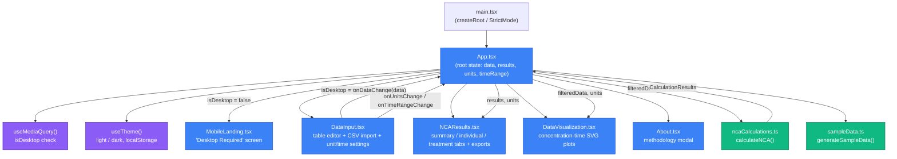
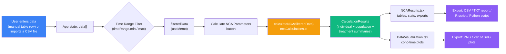
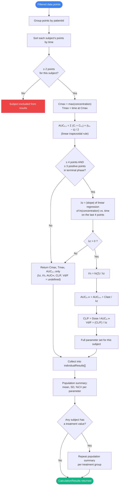
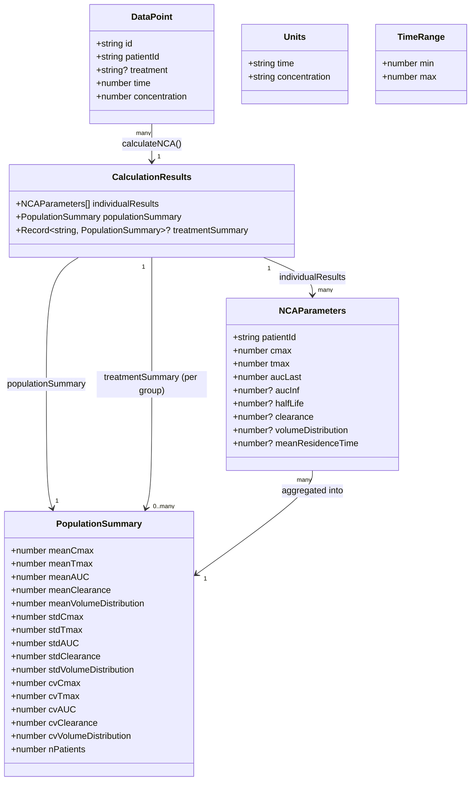
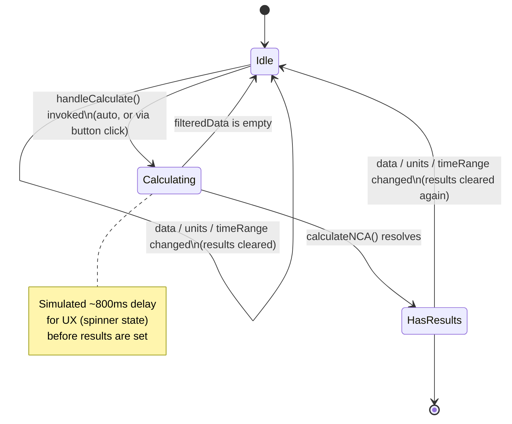
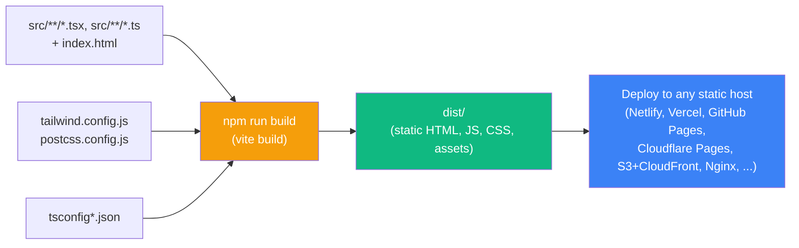

# Compute Non-Compartmental Analysis (NCA)

A browser-based Non-Compartmental Analysis (NCA) calculator for pharmacokinetic (PK) concentration-time data. Enter or import concentration-time data for one or more subjects and instantly get Cmax, Tmax, AUC (trapezoidal), terminal half-life, clearance, and volume of distribution — with population summary statistics, treatment-group comparisons, interactive concentration-time plots, and multi-format export (CSV, text report, R script, Python script).

Live site: **https://nca.pharmacometrics.ai**

> Everything runs client-side in the browser. There is no backend, no database, and no data ever leaves the user's machine.

---

## Table of Contents

- [Overview](#overview)
- [Key Features](#key-features)
- [Tech Stack](#tech-stack)
- [Architecture](#architecture)
- [How It Works (Data Flow)](#how-it-works-data-flow)
- [NCA Calculation Methodology](#nca-calculation-methodology)
- [Data Model](#data-model)
- [Application State Lifecycle](#application-state-lifecycle)
- [Getting Started](#getting-started)
  - [Prerequisites](#prerequisites)
  - [Installation](#installation)
  - [Running the Development Server](#running-the-development-server)
  - [Linting](#linting)
  - [Building for Production](#building-for-production)
  - [Previewing the Production Build](#previewing-the-production-build)
  - [Deployment](#deployment)
- [Project Structure](#project-structure)
- [CSV Import Format](#csv-import-format)
- [Exporting Results](#exporting-results)
- [Units and Time Range Filtering](#units-and-time-range-filtering)
- [Known Limitations & Notes](#known-limitations--notes)
- [License](#license)

---

## Overview

This app is a single-page React application that performs **Non-Compartmental Analysis**, the standard method used in clinical pharmacology and bioequivalence studies to derive pharmacokinetic parameters directly from observed concentration-time data, without assuming a specific compartmental model.

A user (typically a pharmacometrician, clinical pharmacologist, or PK scientist) supplies concentration-time data — either by typing it into an editable table or by importing a CSV — and the app:

1. groups the data by subject,
2. computes individual PK parameters for each subject,
3. aggregates population-level summary statistics (and per-treatment-group statistics, if a treatment column is supplied),
4. renders interactive concentration-time plots (linear and semi-logarithmic), and
5. lets the user export the results as CSV, a plain-text report, or ready-to-run R / Python analysis scripts.

The app ships with a small built-in sample dataset (5 synthetic subjects across two treatment arms) so results are visible immediately on first load.

## Key Features

- **Editable data table** — add, edit, or delete individual concentration-time records inline (ID, TIME, DV, and optional TRT/treatment columns).
- **CSV import** — upload a CSV with flexible header matching (`ID`/`patient`/`subject`, `TIME`/`hour`, `DV`/`conc`/`concentration`, `TRT`/`treatment`/`arm`).
- **Configurable units** — time (hours, minutes, days, weeks) and concentration (ng/mL, μg/mL, mg/L, μM, nM, pM) are labels applied to displayed/exported results.
- **Time-range filtering** — a dual-handle slider restricts which data points are included in the NCA calculation, independent of the full dataset.
- **Automatic per-subject NCA parameters**:
  - Cmax and Tmax (observed maximum concentration and its time)
  - AUC₀₋ₜ via the linear trapezoidal rule
  - Terminal-phase elimination rate constant (λz) via log-linear regression on the last data points
  - Terminal half-life (t½)
  - AUC₀₋∞ (extrapolated to infinity)
  - Apparent clearance (CL/F) and apparent volume of distribution (Vd/F)
- **Population summary statistics** — mean, standard deviation, and %CV for Cmax, Tmax, AUC, clearance, and volume of distribution, both overall and per treatment group (when a treatment column is present).
- **Concentration-time visualization** — linear and semi-logarithmic plots, "all subjects overlay" or "individual subject" view, colored by patient or by treatment, with PNG export and a bulk "download all plots as ZIP" option.
- **Multi-format results export** — CSV table, formatted text report, a self-contained R script, and a self-contained Python (pandas/numpy) script that reproduce the results outside the browser.
- **Light/dark theme** — toggled in the header, persisted to `localStorage`, and respecting the OS preference on first visit.
- **Desktop-first UI** — screens narrower than 1024px show a dedicated "Desktop Required" landing page instead of a cramped mobile layout, since the dense data table and plots need real estate.

## Tech Stack

| Layer            | Choice                                                        |
|-------------------|----------------------------------------------------------------|
| Framework         | [React 18](https://react.dev/) + [TypeScript](https://www.typescriptlang.org/) |
| Build tool        | [Vite 5](https://vitejs.dev/)                                  |
| Styling           | [Tailwind CSS 3](https://tailwindcss.com/) (with `darkMode: 'class'`) |
| Icons             | [lucide-react](https://lucide.dev/)                            |
| Linting           | ESLint 9 + `typescript-eslint`, `eslint-plugin-react-hooks`, `eslint-plugin-react-refresh` |
| Charting          | Hand-rolled inline SVG (no charting library)                   |
| Bulk plot export  | [JSZip](https://stuk.github.io/jszip/), loaded dynamically at runtime from a CDN (not a bundled dependency) |
| Backend           | None — fully static, client-side only                          |

## Architecture

The app is a single-page component tree rooted at `App`, with two custom hooks controlling responsive layout and theme, and two pure-function modules doing the domain math.



All state (`data`, `results`, `units`, `timeRange`, `showAbout`) lives in `App.tsx` and is passed down as props — there is no external state management library (no Redux/Zustand/Context); this is intentional given the app's size.

## How It Works (Data Flow)



Any change to the raw data, units, or time range clears the current `results` (forcing a recalculation) and — via a `useEffect` — automatically re-runs `calculateNCA` whenever there is data but no results, so the results panel is always in sync with the current inputs.

## NCA Calculation Methodology

All math lives in `src/utils/ncaCalculations.ts` and runs entirely client-side.



Key formulas (as also shown in the in-app **About** dialog):

- **AUC (trapezoidal rule):** `AUC₀₋ₜ = Σ [(Cᵢ + Cᵢ₊₁) × (tᵢ₊₁ − tᵢ)] / 2`
- **Terminal slope (λz):** slope of the least-squares linear regression of `ln(concentration)` vs. `time`, computed over the last 4 collected points, restricted to those with `concentration > 0`.
- **Half-life:** `t½ = ln(2) / λz`
- **AUC extrapolated to infinity:** `AUC₀₋∞ = AUC₀₋ₜ + Clast / λz`
- **Clearance and volume of distribution:** `CL/F = Dose / AUC₀₋∞`, `Vd/F = (CL/F) / λz`

> ⚠️ The dose used for `CL/F` and `Vd/F` is currently a **hardcoded placeholder of 100 mg** in `ncaCalculations.ts` (there is no dose input field in the UI yet). Treat clearance and volume of distribution as illustrative only until a real per-subject dose is wired in — see [Known Limitations](#known-limitations--notes).

## Data Model



## Application State Lifecycle

The calculate/results cycle in `App.tsx` behaves like a small state machine:



## Getting Started

### Prerequisites

- **Node.js 18+** (Node 20 LTS recommended) — Vite 5 and the TypeScript/ESLint tooling in this project require it.
- **npm** (ships with Node). The project is committed with a `package-lock.json`, so `npm` is the expected package manager, though `yarn`/`pnpm` will also work if you regenerate a lockfile.

Check your versions:

```bash
node -v
npm -v
```

### Installation

From the project root (the folder containing `package.json`):

```bash
npm install
```

This installs React, Vite, Tailwind, TypeScript, ESLint, and their supporting tooling as declared in `package.json`. No environment variables are required to run the app — the `.env` file in the repo is currently empty and reserved for future configuration (for example, analytics or API keys, if the app grows a backend integration).

### Running the Development Server

```bash
npm run dev
```

This starts the Vite dev server (default: **http://localhost:5173**) with hot module replacement — edits to any file under `src/` are reflected in the browser instantly without a full reload. The app loads with the built-in sample dataset already populated and calculated.

### Linting

```bash
npm run lint
```

Runs ESLint (flat config, `eslint.config.js`) across the project using the TypeScript, React Hooks, and React Refresh rule sets. `dist/` is excluded from linting.

### Building for Production

```bash
npm run build
```

This runs `vite build`, which:

1. type-checks and bundles all TypeScript/React source under `src/`,
2. processes Tailwind CSS (via PostCSS/autoprefixer) and purges unused classes based on `tailwind.config.js` content globs,
3. minifies and code-splits the output, and
4. writes the final static assets to `dist/`.



### Previewing the Production Build

To sanity-check the production bundle locally before deploying:

```bash
npm run build
npm run preview
```

`vite preview` serves the contents of `dist/` locally (default: **http://localhost:4173**), using the exact built assets rather than the dev server, so you can catch build-only issues (missing assets, bundling problems) before shipping.

### Deployment

The app is a fully static bundle with **no server-side component**, so `dist/` can be deployed to any static host or CDN:

- **Netlify / Vercel / Cloudflare Pages** — connect the repo, set the build command to `npm run build` and the publish directory to `dist`.
- **GitHub Pages** — push the contents of `dist/` to a `gh-pages` branch (e.g. via the `gh-pages` npm package or a CI workflow).
- **Any static file server (Nginx, Apache, S3, etc.)** — copy `dist/` to the web root. Because this is a single-page app with client-side routing not currently in use, no special rewrite rules are required today.

The `index.html` currently references `https://nca.pharmacometrics.ai/` (canonical/Open Graph) and `https://pharmacometrics-nca.com/` (some meta tags) inconsistently, and points to icon/manifest files (`favicon-32x32.png`, `apple-touch-icon.png`, `site.webmanifest`, `browserconfig.xml`) that are not currently present in a `public/` folder — see [Known Limitations](#known-limitations--notes) before deploying to production.

## Project Structure

```text
project/
├── index.html                  # HTML shell + SEO/meta tags, mounts #root
├── package.json                # Scripts and dependencies
├── vite.config.ts              # Vite + @vitejs/plugin-react config
├── tailwind.config.js          # Tailwind content paths, dark mode = 'class'
├── postcss.config.js           # Tailwind + autoprefixer
├── tsconfig.json               # Project references (app + node configs)
├── tsconfig.app.json           # Strict TS config for src/
├── tsconfig.node.json          # TS config for Vite's own config file
├── eslint.config.js            # Flat ESLint config
├── .env                        # Empty; reserved for future config
└── src/
    ├── main.tsx                 # React root, mounts <App />
    ├── App.tsx                  # Root component: state, layout, calculate/export logic
    ├── index.css                # Tailwind directives, CSS variables, slider styles
    ├── vite-env.d.ts             # Vite/TS ambient types
    ├── components/
    │   ├── DataInput.tsx         # Editable table, CSV import, unit + time-range settings
    │   ├── NCAResults.tsx        # Summary/individual/treatment tabs, CSV/TXT/R/Python export
    │   ├── DataVisualization.tsx # Concentration-time SVG plots, PNG/ZIP export
    │   ├── About.tsx             # Methodology modal (formulas, workflow, notes)
    │   └── MobileLanding.tsx     # "Desktop Required" screen for narrow viewports
    ├── hooks/
    │   ├── useMediaQuery.ts      # Generic matchMedia hook (used for the desktop breakpoint)
    │   └── useTheme.ts           # Light/dark theme, persisted to localStorage
    ├── types/
    │   └── pharmacometrics.ts    # Shared TypeScript interfaces (see Data Model)
    └── utils/
        ├── ncaCalculations.ts    # calculateNCA(): all PK math (see Methodology)
        └── sampleData.ts         # generateSampleData(): built-in demo dataset
```

## CSV Import Format

The **Data Input** panel's CSV upload accepts a header row with flexible, case-insensitive column matching:

| Required? | Purpose            | Recognized header patterns                              |
|-----------|---------------------|-----------------------------------------------------------|
| Required  | Subject identifier  | `ID`, or any header containing `patient` or `subject`     |
| Required  | Time                | `TIME`, or any header containing `hour`                   |
| Required  | Concentration (DV)  | `DV`, or any header containing `conc` / `concentration`   |
| Optional  | Treatment / arm     | `TRT`, or any header containing `treatment` / `arm`       |

Example:

```csv
ID,TIME,DV,TRT
001,0,0,A
001,0.5,45.2,A
001,1,89.5,A
001,2,125.8,A
002,0,0,A
002,0.5,62.1,A
```

If any of the three required columns can't be matched, the import is rejected with an alert. Rows with fewer than 3 populated columns are skipped.

## Exporting Results

From the **NCA Results** panel, once results are calculated:

- **CSV** — individual subject parameters as a downloadable `.csv`.
- **TXT report** — a formatted plain-text pharmacokinetic report (population summary + individual results table).
- **R script** — a self-contained, commented `.R` file that reproduces the exported results as R data structures.
- **Python script** — a self-contained, commented `.py` file (pandas/numpy-style) that reproduces the exported results.

From the **Visualization** panel:

- **PNG** — the currently displayed concentration-time plot.
- **ZIP of all plots** — every combination of linear/semi-log × all-subjects/individual-subject plots as SVG files, bundled client-side via [JSZip](https://stuk.github.io/jszip/) (loaded on demand from `cdn.skypack.dev` — an internet connection is required the first time this feature is used).

## Units and Time Range Filtering

The **Settings** dropdown in the Data Input panel lets you:

- choose the **time unit** (hours, minutes, days, weeks) and **concentration unit** (ng/mL, μg/mL, mg/L, μM, nM, pM) used purely as display/export labels (values are not unit-converted — enter data already in the units you select), and
- set a **time range filter** (via numeric inputs or a dual-handle slider) that restricts which data points feed into `calculateNCA()`, without deleting or modifying the underlying dataset. Changing either setting clears the current results and triggers a recalculation.

## Known Limitations & Notes

A few things worth knowing if you're extending or deploying this app:

- **Hardcoded dose.** `CL/F` and `Vd/F` assume a fixed 100 mg dose (`ncaCalculations.ts`); there is no dose input in the UI yet, so these two parameters are illustrative rather than accurate for real studies until a per-subject/per-treatment dose field is added.
- **Terminal-phase requirements.** Half-life, AUC₀₋∞, clearance, and volume of distribution are only computed for subjects with at least 4 time points where at least 3 of the last 4 have a positive concentration; otherwise those fields are left `undefined` (shown as "N/A").
- **No unit conversion.** Selecting a different time/concentration unit only changes labels — it does not rescale existing data values.
- **External runtime dependency for bulk plot export.** The "download all plots as ZIP" feature dynamically imports JSZip from a CDN (`cdn.skypack.dev`) at click-time rather than bundling it, so that feature requires network access and will fail offline.
- **Desktop-only UI.** Viewports narrower than 1024px render `MobileLanding.tsx` instead of the working app — there is currently no responsive/mobile layout for the data table and plots.
- **Missing static assets.** `index.html` references `apple-touch-icon.png`, `favicon-32x32.png`, `favicon-16x16.png`, `site.webmanifest`, and `browserconfig.xml`, none of which currently exist in a `public/` folder — add a `public/` directory with these assets before relying on them in production.
- **Inconsistent canonical domain.** SEO/meta tags in `index.html` reference both `nca.pharmacometrics.ai` and `pharmacometrics-nca.com` — worth reconciling to a single canonical domain.
- **No automated tests.** There is currently no test runner/config in the project.
- **No persistence.** Data entered in the UI is only ever kept in React state; refreshing the page resets to the built-in sample dataset. There is no save/load or backend of any kind.

## License

No license file is currently included in this repository. Add a `LICENSE` file to clarify reuse terms before distributing or open-sourcing this project.
